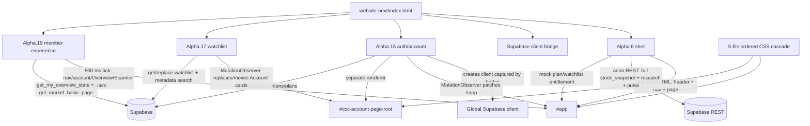
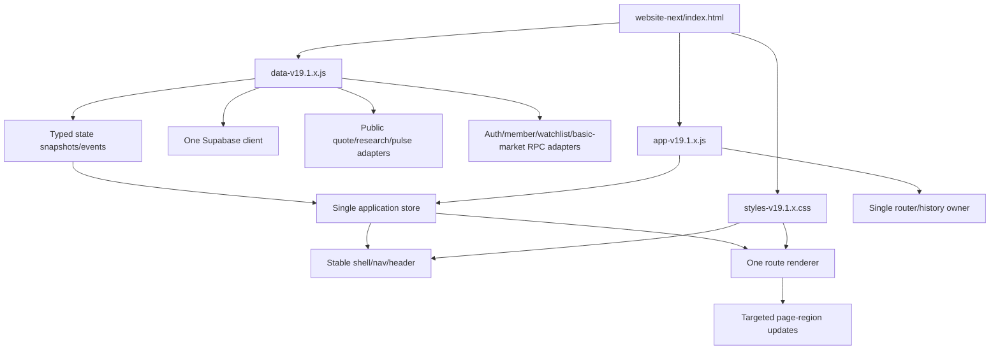

# CCC v19 Frontend Consolidation Audit

**Phase:** 0 — audit only  
**Repository:** `manhcang2026/vnstock-market-scanner`  
**Branch inspected:** `feature/user-auth-foundation`  
**Audit date:** 2026-08-23  
**Staging target:** `website-next/` / `zoom.chuyenchochung.com`  
**Production source of truth:** `website/` — not modified  
**Recommendation:** approve a clean `v19.1.x` consolidation; do not extend the Alpha patch stack.

## 1. Executive conclusion

The visible flicker and layout regressions are architectural, not isolated styling bugs.

The current staging page has four independent DOM writers after the base shell:

1. `app-v19.0-alpha.6-shell.js` renders the complete shell and page from mock/legacy state.
2. `auth-v19.0-alpha.15.js` observes that DOM, changes labels/layout, owns a separate Account root, and patches membership state into mock UI.
3. `watchlist-v19.0-alpha.17.js` observes the Account DOM, replaces a placeholder card, moves Account cards between columns, and rewrites user-facing words.
4. `member-experience-v19.0-alpha.19.js` polls every 500 ms, hides/replaces navigation, rewrites Overview, and replaces the entire Scanner main element.

Five ordered CSS files then restyle many of the same component families. The loaded CSS contains 239 `!important` declarations, 170 of them in the auth stylesheet. Later files correct earlier files rather than sharing explicit ownership.

This creates the observed sequence:

`SHELL renders old/mock state → AUTH patches → WATCHLIST patches → ALPHA.19 patches → later shell/auth activity recreates or changes the DOM → patches run again`.

The correct fix is a deterministic state-driven runtime with:

- one data/auth adapter that never writes DOM;
- one application owner for routing, shell, navigation, headings, page structure, Overview and Scanner;
- one consolidated stylesheet;
- no normal-page `MutationObserver` patching, no 500 ms repair loop, no label replacement after paint, and no mock technical state rendered before entitlement is known.

No user-facing code was changed during this audit.

## 2. Sources inspected

The audit was checked against:

- repository `AGENTS.md`;
- all mandatory UI/UX standards and Phase 1 references;
- all mandatory product/membership and Alpha.17–19 documents;
- `website/index.html`, `website/VERSION.txt`, and production v18.5 assets;
- `website-next/index.html`, `VERSION.txt`, `.htaccess`, every currently loaded local JS/CSS file, and relevant older Alpha.17/18 assets;
- Watchlist/VIP/Overview database reference documents and every current frontend REST/RPC call.

Lovable was not called. Supabase schema, RLS, RPCs, migrations and backend code were not changed.

## 3. Current runtime inventory

`website-next/index.html` loads assets in this exact order.

### 3.1 CSS

| Order | File | Bytes | Current role | `!important` count |
|---:|---|---:|---|---:|
| 1 | `styles-v19.0-alpha.6-shell.css` | 79,994 | tokens, shell, all pages, Overview, Scanner, detail, research | 36 |
| 2 | `auth-v19.0-alpha.15.css` | 45,663 | auth/account plus several global readability/header/Overview/Scanner corrections | 170 |
| 3 | `watchlist-v19.0-alpha.16.css` | 4,940 | original Watchlist editor styling | 0 |
| 4 | `member-experience-v19.0-alpha.17.css` | 11,933 | later Account/Watchlist/VIP/Overview styling; overrides much of Alpha.16 | 21 |
| 5 | `member-experience-v19.0-alpha.19.css` | 6,229 | tabs, demo state, pagination, Scanner/market rows, final responsive patches | 12 |

Total loaded local CSS: **148,759 bytes**.

### 3.2 JavaScript

| Order | File | Bytes | Current role |
|---:|---|---:|---|
| 1 | Supabase JS CDN `@supabase/supabase-js@2.112.3` | external | library |
| 2 | `supabase-bridge-v19.0-alpha.16.js` | 633 | monkey-patches `createClient()` to expose the later auth client globally |
| 3 | `app-v19.0-alpha.6-shell.js` | 144,279 | base route selection, full shell/page render, theme, direct REST data, cache/trust, research/detail, mock membership |
| 4 | `auth-v19.0-alpha.15.js` | 59,825 | creates Supabase client, auth/profile/membership, Account route/root, shell patching observer |
| 5 | `watchlist-v19.0-alpha.17.js` | 26,337 | Watchlist RPC/search/editor and Account DOM patching observer |
| 6 | `member-experience-v19.0-alpha.19.js` | 22,099 | Overview entitlement UI, two-tab Scanner, market-basic RPC, nav/account patches, 500 ms repair loop |

Total loaded local JS: **253,173 bytes**.

All referenced files exist. Staging version is `v19.0-alpha.19-stabilization`. Production remains `v18.5-final800-near-ma`.

## 4. Current architecture diagram

There is no single route store or single render owner. Runtime correctness depends on load order, mutation timing, selector specificity, polling and text matching.

## 5. Ownership map

| Concern | Current effective owner(s) | Finding |
|---|---|---|
| Route | Shell snapshots route once; Auth separately pushes Account history; Alpha.19 reads `location.pathname`; browser reloads most anchor routes | Split ownership |
| Global shell | Shell renders it; Auth later patches header/status/account; Alpha.19 later patches nav | Competing writers |
| Desktop/mobile nav | Shell emits `Bộ quét` and disabled `Watchlist`; Alpha.19 hides/replaces them; Auth patches Account button | Competing writers |
| Theme | Shell state + DOM attribute + full rerender | Keep behavior, change update strategy |
| Auth/session | Auth module | Clear data owner, but it also owns unrelated DOM patches |
| Profile/membership | Auth direct table reads and Account renderer | Data is useful; rendering/patch bridge must be consolidated |
| Account | Auth renders a separate root; Watchlist replaces/moves its cards; Alpha.19 adds anchors/scroll effects | Three owners |
| Watchlist | Watchlist module owns RPC/search/save, but discovers a placeholder by text and replaces it | Good data behavior, fragile UI integration |
| Overview | Shell renders mock/default `2plus`; Auth rewrites subtitle/presentation; Alpha.19 rewrites KPI/results | Three owners |
| Scanner `/danh-sach` | Shell first renders mock scanner with rail; Alpha.19 later replaces the entire `<main>` | Two full renderers |
| Research routes | Shell renders; Auth later adds/changes rail and typography | Two owners |
| Detail | Shell owns detail and direct quarterly data | One renderer, but shell entitlement is mock |
| Entitlement | Shell mock plan/watchlist; Auth patches real plan into mock UI; Alpha.19 uses safe Overview RPC; Watchlist uses server RPC | Conflicting truth sources |
| Data Trust/cache | Shell owns live/cached market state; Auth hides fields and adds a second refresh timer/source cards | Duplicate presentation and timers |

## 6. Exact causes of flicker and regressions

### 6.1 Navigation flicker

- Shell initially emits a real `Bộ quét` link and a disabled `Watchlist` placeholder (`app-v19.0-alpha.6-shell.js:673`).
- Alpha.19 later searches by visible text, hides `Bộ quét`, renames `Watchlist`, converts the placeholder to an anchor and changes its `href` (`member-experience-v19.0-alpha.19.js:15`).
- Every shell full render recreates the old nav (`app-v19.0-alpha.6-shell.js:1077-1084`), so the repair must run again.
- Alpha.19's `tick()` performs this repair every 500 ms (`member-experience-v19.0-alpha.19.js:33-34`).

Therefore the obsolete label is present in initial DOM and can paint before it is hidden.

### 6.2 Overview subtitle and render loop

- Shell initially renders: `Nhịp thị trường, mật độ hội tụ tín hiệu và lực dòng tiền trong phạm vi của bạn.` (`app-v19.0-alpha.6-shell.js:877`).
- Auth polish changes it to: `Theo dõi thị trường, tín hiệu nổi bật và dòng tiền trong phạm vi của bạn.` (`auth-v19.0-alpha.15.js:602`).
- Alpha.19 changes it again to the locked current subtitle (`member-experience-v19.0-alpha.19.js:22`).
- Auth observes the whole `#app` subtree and schedules polish after mutations (`auth-v19.0-alpha.15.js:1332-1344`).
- Alpha.19 checks every 500 ms for a subtitle mismatch and calls `loadO(true)` before rerendering (`member-experience-v19.0-alpha.19.js:33`). `loadO(true)` calls `get_my_overview_state` again.

This is a concrete auth/Alpha.19 ping-pong condition that can cause repeated DOM work and repeated entitlement RPCs while Overview is open.

### 6.3 Wrong default Overview before entitlement resolves

- Shell state starts with `overviewGroup: "2plus"` (`app-v19.0-alpha.6-shell.js:49`) and `overviewHtml()` falls back to `2plus` (`:855`).
- Current product behavior requires no selected KPI and all effective tracked symbols.
- Alpha.19 corrects the state only after session/client/RPC readiness.

The user can therefore see the wrong selected state, old copy and mock rows first.

### 6.4 Protected technical-content flash risk

- Shell immediately performs an anonymous `select=*` read of full `stock_snapshot` and renders technical values (`app-v19.0-alpha.6-shell.js:4-15`, `:1302-1339`).
- Shell entitlement is a local staging mock, not authenticated authorization (`:21-34`, `:323-358`).
- The loaded Alpha.17 CSS has a rule intended to hide results while `body.ccc-member-entitlement-loading` is present, but none of the current loaded JS sets that class.
- For a guest, Alpha.19's authenticated Overview loader returns no state, so the safe demo never replaces the shell's technical page.

This is both a visual flash defect and a known security-closure debt. It does not prove the database itself is locked; existing project documents explicitly say direct anonymous `stock_snapshot` access remains legacy debt.

### 6.5 Scanner layout regression and lost right rail

- Shell creates the approved page header/content-grid/right-rail structure and renders a Scanner context rail.
- Alpha.19 then assigns a new string to `main.lovable-scanner.innerHTML` (`member-experience-v19.0-alpha.19.js:28`).
- That replacement contains heading, tabs, filters and results, but no `content-grid` or `context-rail`.

The right rail disappears by construction, and the page becomes a single large column.

### 6.6 Account/watchlist instability

- Auth renders the Account into a separate body-level root and hides the shell page with CSS (`auth-v19.0-alpha.15.css:2-5`). This permits a shell page to exist before the Account body class/root is ready.
- Watchlist finds a placeholder card by its text, replaces its `innerHTML`, and moves Watchlist/membership cards between main and side columns according to viewport (`watchlist-v19.0-alpha.17.js:93-155`, `:235-270`).
- Watchlist observes all Account child mutations and also schedules repair after popstate, resize and every document click (`:437-464`).
- Alpha.17 membership CSS duplicates and overrides Alpha.16 Watchlist selectors.

Account quality therefore depends on render timing, text discovery and cascade order rather than a stable component contract.

### 6.7 CSS collision evidence

- Loaded CSS has **239** `!important` declarations.
- `watchlist-v19.0-alpha.16.css` and `member-experience-v19.0-alpha.17.css` define the same selector families with different spacing, type sizes, layout modes, colors and breakpoints, including `.ccc-wl-metrics`, `.ccc-wl-actions`, `.ccc-wl-result`, `.ccc-wl-search-results` and `#ccc-wl-search`.
- Base shell CSS defines the Overview row as four columns (`styles...:237+`), then later sections inside the same file expand it to five zones; auth CSS later forces its own five-column values with `!important`; Alpha.19 adds another row-context layer.
- Auth CSS styles global shell/Overview/Scanner/research components even though it is nominally an auth asset.

The CSS filenames no longer describe ownership boundaries.

### 6.8 Excessive whole-page replacement

- Shell's `render()` always assigns all header/nav/page HTML to `app.innerHTML`, then rebinds handlers (`app...:1077-1187`). Theme toggles, refresh transitions, data completion, detail changes and several filters invoke this full render.
- Alpha.19 Scanner separately replaces the whole Scanner main for small filter/input changes.
- Auth and Watchlist then repair the new nodes.

This destroys stable nodes/focus/scroll more often than required and explains jerky transitions.

## 7. Current data and security contracts

### 7.1 Direct frontend reads in the shell

The shell currently reads:

- `stock_snapshot?select=*` — all market and protected technical fields;
- `financial_latest?select=*`;
- `stock_metadata?select=*`;
- `market_pulse_current?select=*`;
- `financial_quarterly?select=*` on detail;
- latest `stock_snapshot.updated_at` for polling.

Auth additionally reads a duplicate subset of `stock_snapshot` for MA10/MA200 UI patches and directly reads `profiles`, `subscriptions` and `plans`.

### 7.2 Existing safe/member RPCs

| RPC | Caller | Contract confirmed by repository references |
|---|---|---|
| `get_my_overview_state()` | Alpha.19 | authenticated; market KPI aggregates; entitled technical rows; FULL/VIP dynamic universe; selected count and six fixed samples in Alpha.19 reference |
| `get_market_basic_page(...)` | Alpha.19 | authenticated; paged whole-market basic fields only; no CCC/RVOL30 fields |
| `get_my_watchlist_state()` | Watchlist | authenticated own state, quota/capacity/windows, symbols and metadata items |
| `replace_my_watchlist(text[])` | Watchlist | authenticated atomic replacement; backend enforces capacity/quota/universe |
| `save_my_profile(...)` | Auth | authenticated profile save |

The Watchlist backend remains authoritative. Frontend estimates are advisory only.

### 7.3 Unresolved backend-contract gaps — do not guess

These gaps must be confirmed before their implementation phases. They are not authorization to change Supabase.

1. **Guest six-symbol demo:** `get_my_overview_state()` is documented/authored as authenticated. A guest-safe contract for the fixed six technical sample rows is not present in the repository.
2. **Guest whole-market basic view:** `get_market_basic_page(...)` is documented as authenticated-only. The Product Owner must confirm whether guest access to `Toàn bộ thị trường` is required; if yes, an anon-safe basic contract is needed.
3. **Global nearest-MA sorts:** current Alpha.19 passes high/low MA200 sorts and offers no MA10 sort. The required `ABS(ma*_distance_pct)` order must be applied before server pagination. The repository does not contain the RPC definition, so support for `ma200_near`/`ma10_near` cannot be verified locally.
4. **Legacy anonymous technical access:** full direct `stock_snapshot` must remain until all dependent legacy surfaces are migrated, but production technical lockdown cannot be claimed while it remains public.

Any required RPC/RLS/schema change needs a separate Product Owner approval.

## 8. KEEP / PORT / retire decision

`Retire from runtime` means remove from `index.html` after its required behavior is ported. Old files remain on disk for rollback.

| Asset/behavior | Decision | Rationale |
|---|---|---|
| v18.5 real field normalization, cache/fallback, trust logic, research/detail behavior | **PORT** | Proven production behavior; preserve data honesty and failure handling |
| v18.5 absolute nearest MA10/MA200 sort semantics | **PORT** | Matches latest locked requirement |
| Alpha.6 visual tokens, PORT-01 shell geometry, selected research/detail components | **PORT** | Approved direction, but extract into consolidated CSS |
| Alpha.6 `app.innerHTML` full renderer | **RETIRE FROM RUNTIME** | Recreates shell/page and forces repair layers |
| Alpha.6 mock plan/watchlist/entitlement | **DELETE FROM RUNTIME** | Wrong truth source and flash risk |
| Alpha.6 direct full technical snapshot for entitled member pages | **PORT OFF THIS CONTRACT** | Replace with safe/member data contracts as phases allow |
| Alpha.15 Supabase auth/session, Google/email flows, profile/membership reads | **PORT** | Real functional foundation |
| Alpha.15 Account visual/content quality | **PORT in Phase 4** | Do not redesign; move under one renderer |
| Alpha.15 observer/polish/text replacement/duplicate refresh timer/direct MA patch fetch | **DELETE FROM RUNTIME** | Causes conflicts and duplicate data work |
| Alpha.16 bridge | **KEEP ONLY FOR ROLLBACK** | New data adapter should create/export exactly one client directly |
| Alpha.17 Watchlist RPC/search/save/error mapping | **PORT in Phase 4** | Correct server-authoritative behavior |
| Alpha.17 Watchlist observer, text replacement and card movement | **DELETE FROM RUNTIME** | Fragile DOM ownership |
| Alpha.17 Overview/VIP styling and loading-state intent | **PORT selectively** | Useful states; dead class mechanism must not be copied |
| Alpha.18 default Overview/list/tab/pagination behavior | **PORT behavior only** | Product intent is useful; observer/direct market read is not |
| Alpha.19 safe market RPC, fixed demo behavior, KPI reset, tabs, pagination/load-more, footer links | **PORT behavior only** | Latest functional intent |
| Alpha.19 nav patch, 500 ms tick, forced RPC reload, whole-main Scanner replacement | **DELETE FROM RUNTIME** | Direct causes of flicker/jank/regression |
| All current loaded CSS files | **KEEP ONLY FOR ROLLBACK after consolidation** | Port selected rules into one owner stylesheet; do not keep cascade stack |

## 9. Proposed target architecture

### 9.1 Ownership contract

#### `data-v19.1.x.js`

- creates and owns one Supabase client;
- exposes auth/session/profile/membership/watchlist/Overview/market/research methods;
- owns request cancellation, caching metadata and normalized error objects;
- may emit state events or return promises;
- **must not** query or mutate DOM, use History API, choose labels, or apply CSS classes.

#### `app-v19.1.x.js`

- owns `#app` and all modal/page UI;
- owns routing, History API, internal-link interception and popstate;
- owns global navigation, page shell, full-width Page Header and main/right-rail grid;
- owns initial loading/guest/authenticated/entitlement-safe structure;
- owns Overview and Scanner rendering;
- owns Account rendering by Phase 4;
- uses event delegation and targeted region updates;
- never renders mock protected data while auth/entitlement is unknown.

#### `styles-v19.1.x.css`

- one runtime stylesheet organized as tokens → shell → components → pages → responsive → reduced motion;
- Light and Dark tokens defined together;
- no phase-named patch sections;
- no ownership through file order;
- `!important` allowed only with a documented unavoidable reason.

### 9.2 Deterministic bootstrap

1. Read route and theme synchronously.
2. Render the correct final nav labels and a stable route skeleton once.
3. Start the data adapter.
4. Resolve session/access before any protected technical region can render.
5. Render guest/member/locked/entitled content directly from explicit state.
6. Keep current content visible during background refresh; update trust/error regions independently.

No obsolete label or protected technical cell exists in the initial DOM.

### 9.3 Rendering discipline

- Shell nodes remain stable across filter changes.
- Route change renders Page Header then `content-grid` with main + optional rail.
- KPI/filter/pagination interactions update only their results/context regions.
- Search is debounced and stale requests are ignored/aborted.
- Theme swaps tokens without a page reload or full app reconstruction.
- Route state stores search/filter/tab/page/scroll when navigating away and restores on back.
- Motion uses shared tokens and respects `prefers-reduced-motion`.

## 10. Exact planned file changes

No files below are authorized for implementation until the corresponding phase is approved.

### Phase 1 recommended baseline: `v19.1.0-shell`

Create:

- `website-next/assets/data-v19.1.0.js`
- `website-next/assets/app-v19.1.0.js`
- `website-next/assets/styles-v19.1.0.css`
- `docs/refactor/CCC_V19_PHASE1_REPORT.md`

Modify:

- `website-next/index.html`
- `website-next/VERSION.txt`

No expected `.htaccess` change. If a verified routing/header need appears, stop and report it rather than changing it silently.

Remove from `index.html` after required behavior is ported and verified:

- `styles-v19.0-alpha.6-shell.css`
- `auth-v19.0-alpha.15.css`
- `watchlist-v19.0-alpha.16.css`
- `member-experience-v19.0-alpha.17.css`
- `member-experience-v19.0-alpha.19.css`
- `supabase-bridge-v19.0-alpha.16.js`
- `app-v19.0-alpha.6-shell.js`
- `auth-v19.0-alpha.15.js`
- `watchlist-v19.0-alpha.17.js`
- `member-experience-v19.0-alpha.19.js`

The old files remain physically present for rollback.

### Subsequent version recommendation

| Phase | Suggested staging version | Asset strategy |
|---|---|---|
| 2 Overview | `v19.1.1-overview` | copy forward three consolidated assets with `v19.1.1` names; update index/version |
| 3 DS/market | `v19.1.2-scanner` | copy forward three consolidated assets with `v19.1.2` names |
| 4 Account | `v19.1.3-account` | copy forward three consolidated assets with `v19.1.3` names |
| 5 closure | `v19.1.4-qa` | final consolidated assets and index cleanup |

This gives cache-busted, phase-level rollback without continuing `alpha.20` patch naming.

## 11. Migration plan by stop gate

### Phase 1 — shell/routing/nav

- establish store, router, data adapter and stable shell;
- emit correct nav labels in initial render;
- establish Page Header + main/right-rail structural contract;
- port auth/session without observer patching;
- port current research routes sufficiently to avoid route deletion;
- keep Account behavior intact through an explicit temporary route renderer, not a MutationObserver;
- do not implement Phase 2/3 product redesign work.

### Phase 2 — Overview

- implement explicit guest, empty FREE, capped, FULL and VIP states;
- add default all-tracked state, KPI filter/reset and upsell;
- resolve the guest demo data contract before code if still absent;
- ensure no protected-content flash under slow/failed auth/RPC.

### Phase 3 — DS / whole market

- implement default tracked tab and basic-market tab;
- retain right rail and correct pagination/load-more;
- verify safe RPC global sort semantics before implementing nearest MA sorts;
- prevent protected detail for non-entitled symbols.

### Phase 4 — Account

- move profile, membership, Watchlist editor and security into the single renderer;
- preserve Alpha.17 visual quality and backend-authoritative Watchlist behavior;
- remove placeholder discovery, card movement and word replacement;
- verify anchors after route render.

### Phase 5 — closure

- confirm only the three consolidated local assets are loaded;
- verify old assets remain available only for rollback;
- close or explicitly document remaining backend/security debt;
- run full CCC QA matrix and produce final packages.

## 12. Rollback strategy

1. Keep every current Alpha asset unchanged on disk.
2. Before each implementation phase, record SHA-256 hashes of `index.html`, `VERSION.txt` and active assets in the phase report/package README.
3. Each phase creates new versioned assets; it does not overwrite the previous phase's assets.
4. Rollback is an atomic replacement of `website-next/index.html` and `VERSION.txt` to reference the prior known-good asset set.
5. Do not delete old cPanel assets during staging rollout unless a later cleanup phase explicitly approves it.
6. Keep repo package and cPanel package for each approved phase.
7. Do not use rollback to restore unsafe schema/RLS state; backend changes, if separately approved later, need their own migration rollback plan.

Current Alpha.19 SHA prefixes recorded during this audit are:

- shell JS `A8D802C1593E`
- auth JS `5F9DB9CF3F5A`
- watchlist JS `B821AB166815`
- member JS `A7501B0034E6`
- bridge JS `DAC89E61E065`
- shell CSS `F6481A882ED8`
- auth CSS `01229A206712`
- watchlist CSS `8BC7CB75C42F`
- member Alpha.17 CSS `C070027074A8`
- member Alpha.19 CSS `D6ED9DCA53D3`

## 13. Risk register

| Risk | Severity | Mitigation/gate |
|---|---|---|
| Protected technical content appears before entitlement | Critical | entitlement-safe initial state; slow-network/failed-RPC tests; remove direct full snapshot dependency before security claim |
| Guest demo/basic data lacks safe backend contract | High | stop and request backend approval; do not reuse protected snapshot |
| Nearest-MA global sort unsupported by paged RPC | High | verify RPC definition/behavior before Phase 3; server-side sort if paging is server-side |
| Research routes regress while replacing shell | High | port and smoke-test all existing routes in Phase 1; do not silently remove them |
| Account Google/email/OAuth redirect regression | High | direct URL, callback, refresh and sign-out tests on staging |
| Watchlist quota/business rule altered in frontend | High | keep `replace_my_watchlist` authoritative; frontend never finalizes quota logic |
| Right rail lost again | High | shared structural component + layout assertions/screenshots at 1024/1440 |
| CSS consolidation changes Light/Dark contrast | Medium/High | token pair review and independent theme QA |
| Full app rerender loses focus/scroll/filter state | Medium/High | stable shell, route state snapshots, keyboard/back tests |
| Data refresh replaces valid cache with blank/error | High | keep-last-good state and separate refresh status |
| Duplicate/stale async responses overwrite new search state | Medium | request sequence/AbortController in data adapter |
| Old assets accidentally deleted from cPanel | Medium | deployment README says retain; rollback check before upload |

## 14. Phase 1 test matrix

### 14.1 Static and architecture checks

- `node --check` for every new JS asset.
- All `index.html` local asset references exist and are versioned.
- Exactly one Supabase client is created.
- No `MutationObserver` in normal shell/nav/page rendering.
- No 500 ms repair/poll loop.
- No initial DOM text `Bộ quét`.
- No loaded Alpha patch assets unless the phase report gives a specific temporary justification.
- Search source for duplicate route/nav/page render owners.

### 14.2 Routes and history

Test direct load, click navigation, refresh, back and forward for:

- `/`
- `/danh-sach`
- `/danh-sach?tab=market`
- `/so-sanh-theo-nganh`
- `/sang-loc-co-ban`
- `/tai-khoan`
- `/tai-khoan#ds-ma-theo-doi`
- `/tai-khoan#goi-thanh-vien`

Verify correct `aria-current`, Page Header before content grid, stable scroll/focus, and no obsolete intermediate label.

### 14.3 Session/access states

- guest;
- signed-in FREE with empty Watchlist;
- signed-in FREE/capped with symbols;
- FULL;
- active VIP Day;
- expired session;
- auth library failure;
- membership RPC/table failure.

Phase 1 does not need final Phase 2/3 visuals, but must not expose protected data or show a false membership state.

### 14.4 Responsive/theme matrix

Run each relevant Phase 1 route at:

- 375 px;
- 768 px;
- 1024 px;
- 1440 px;

For both Light and Dark, verify:

- no horizontal overflow;
- desktop main/right rail remains aligned;
- no persistent mobile rail;
- mobile nav does not cover content;
- focus is visible;
- text/borders/states remain readable;
- theme toggle does not reload or reconstruct the whole page;
- `prefers-reduced-motion` disables decorative motion.

### 14.5 Loading/error/performance

- cold load with no cache;
- valid cache + slow background refresh;
- stock/public research/pulse failure independently;
- entitlement failure independently;
- offline/retry state;
- logo missing;
- rapid route changes;
- rapid filter/search typing where present;
- refresh while data is already displayed;
- confirm current data remains visible during refresh/error;
- inspect network for unintended repeated `get_my_overview_state` calls;
- inspect layout shift while fonts/auth/data arrive.

### 14.6 Security/entitlement observation

With network throttling and blocked entitlement calls:

- inspect initial HTML/DOM and screenshots frame by frame;
- confirm no technical row, CCC rail, RVOL30, signal identity or mock plan flashes;
- confirm basic/public layers remain usable where allowed;
- confirm non-entitled stock detail cannot open protected technical content.

## 15. Audit verification performed

- Confirmed active branch: `feature/user-auth-foundation`.
- Confirmed production `website/` was not edited.
- Confirmed every loaded staging asset exists and recorded size/hash.
- Confirmed current JS syntax with `node --check` is part of the final Phase 0 verification log.
- Confirmed two active `MutationObserver`s (Auth and Watchlist) and Alpha.19's 500 ms repair interval.
- Confirmed exact old nav label source and later hide/rename logic.
- Confirmed exact three-way Overview subtitle ownership and forced Alpha.19 reload condition.
- Confirmed Scanner right rail is absent from Alpha.19 replacement markup.
- Confirmed current whole-market sort UI does not implement required absolute nearest MA10/MA200 behavior.
- Confirmed no frontend, backend, schema, RLS, RPC, migration, production, deploy, commit or push change was made in Phase 0.

## 16. Approval required to continue

Approve **Phase 1 only** if the Product Owner accepts:

1. the `v19.1.0-shell` version baseline;
2. the three-asset target (`data`, `app`, `styles`);
3. removal of all current Alpha runtime layers from `index.html` only after their required behavior is ported and verified;
4. retention of old assets on disk for rollback;
5. the explicit stop on guest-demo/guest-basic/nearest-sort backend gaps until their contracts are confirmed or separately approved.

Phase 2 must not begin with Phase 1 approval.
